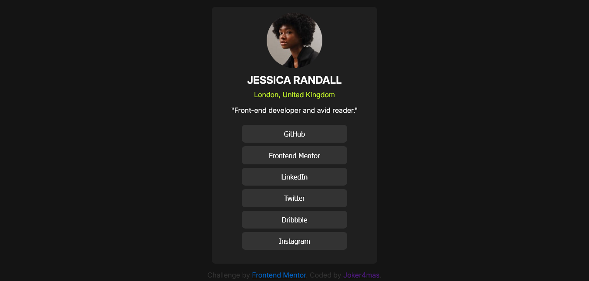

# Frontend Mentor - Social links profile solution

This is a solution to the [Social links profile challenge on Frontend Mentor](https://www.frontendmentor.io/challenges/social-links-profile-UG32l9m6dQ). Frontend Mentor challenges help you improve your coding skills by building realistic projects. 

## Table of contents

- [Frontend Mentor - Social links profile solution](#frontend-mentor---social-links-profile-solution)
  - [Table of contents](#table-of-contents)
  - [Overview](#overview)
    - [The challenge](#the-challenge)
    - [Screenshot](#screenshot)
    - [Links](#links)
  - [My process](#my-process)
    - [Built with](#built-with)
    - [What I learned](#what-i-learned)
    - [Continued development](#continued-development)
  - [Author](#author)

## Overview

### The challenge

Users should be able to:

- See hover and focus states for all interactive elements on the page

### Screenshot

### Links

- Solution URL: [Add solution URL here](https://github.com/Joker4mas/social-links-FE)
- Live Site URL: [Add live site URL here](https://socialsx.netlify.app/)

## My process
- Started out with the HTML template
- Next design the UI with Css

### Built with

- Semantic HTML5 markup
- CSS custom properties
- Flexbox
- Mobile-first workflow
- For styles CSS

### What I learned

I learned more about Flex box layouts, margins and padding. learnt about the difference between px, rem and em and where they are applicable.

### Continued development

I want to carry on learning more about Flex-box and grid box, when i familiarize myself with them, then i'd learn more on transition and animation.

## Author

- Website - [Joker4mas](samuel-ogbaje.vercel.app)
- Frontend Mentor - [@Joker4mas](https://www.frontendmentor.io/profile/Joker4mas)
- Twitter - [@Joker4mas](https://www.twitter.com/Joker4mas)
